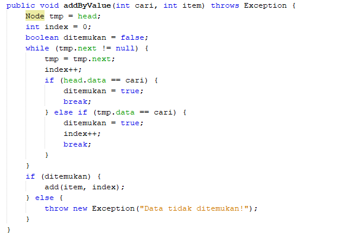
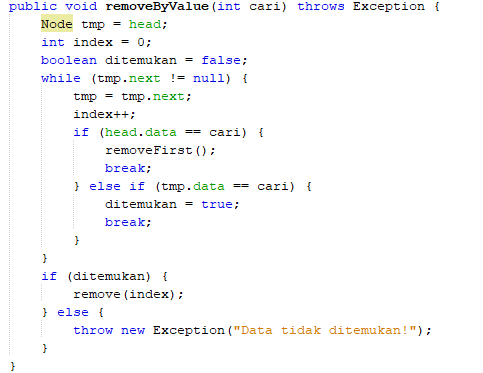

1. Mengapa pada proses traverse nilai head perlu disimpan terlebih dahulu dalam variabel tmp ?
~ Proses traverse nilai head perlu disimpan terlebih dahulu dalam variabel tmp karena variabel tmp digunakan sebagai variabel bantuan, dimana variabel ini berfungsi untuk mengunjungi setiap data satu persatu pada linked list dan memeriksanya, jika data tersebut tidak bernilai null, maka data akan dicetak setelah itu variabel tmp diubah menjadi data yang diambil dari head.next yaitu data selanjutnya.
2. Apa kekurangan implementasi single LinkedLists tanpa penunjuk tail ?
~ Kekurangan dari penggunaan linked list tanpa tail adalah diperlukan perulangan menggunakan variabel bantuan untuk menambahkan data baru pada akhir linked list, sedangkan apabila menggunakan tail, maka data yang baru akan langsung ditaruh pada urutan yang paling belakang. 
3. Tambahkan implementasi method addByValue berdasarkan nilai yang dicari! Node baru akan ditambahkan setelah node yang dicari ditemukan.
~ Modifikasi pada project minggu11, package minggu11, class modifikasiLinkedLists.java dan ModifikasiMainLinkedLists.java 
4. Tambahkan implementasi method removeByValue berdasarkan nilai yang dicari! 
~ Modifikasi pada project minggu11, package minggu11, class modifikasiLinkedLists.java dan ModifikasiMainLinkedLists.java  
5. Tambahkan menu serta submenu dan inputan dinamis (semua tipe data) pada program percobaan tersebut !
~ modifikasi pada project minggu11, package minggu11, class modifikasiLinkedLists.java dan ModifikasiMainLinkedLists.java