Nama      : Moch Farchan Agil

Kelas     : 1F

Absen/NIM : 15/1941720204

#Screenshot program
1. Class MainLinkedList
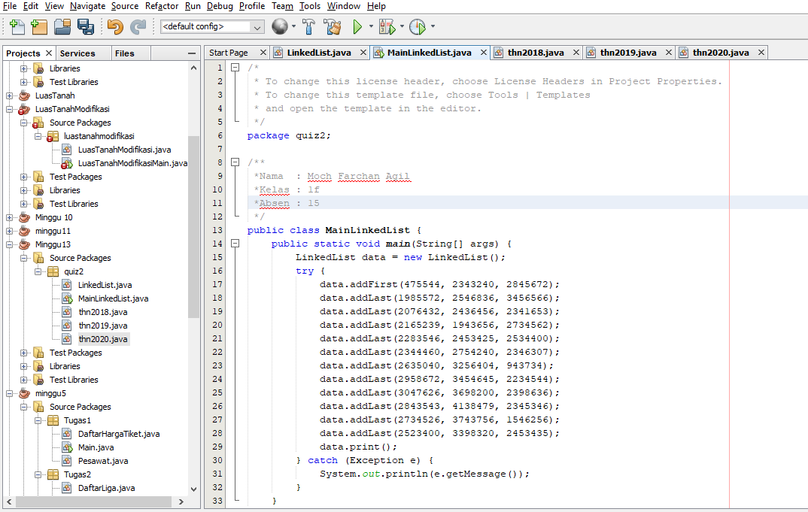

2. Class LinkedList 
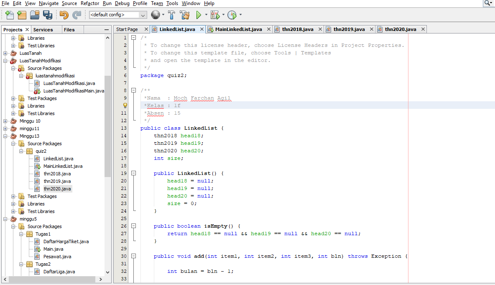
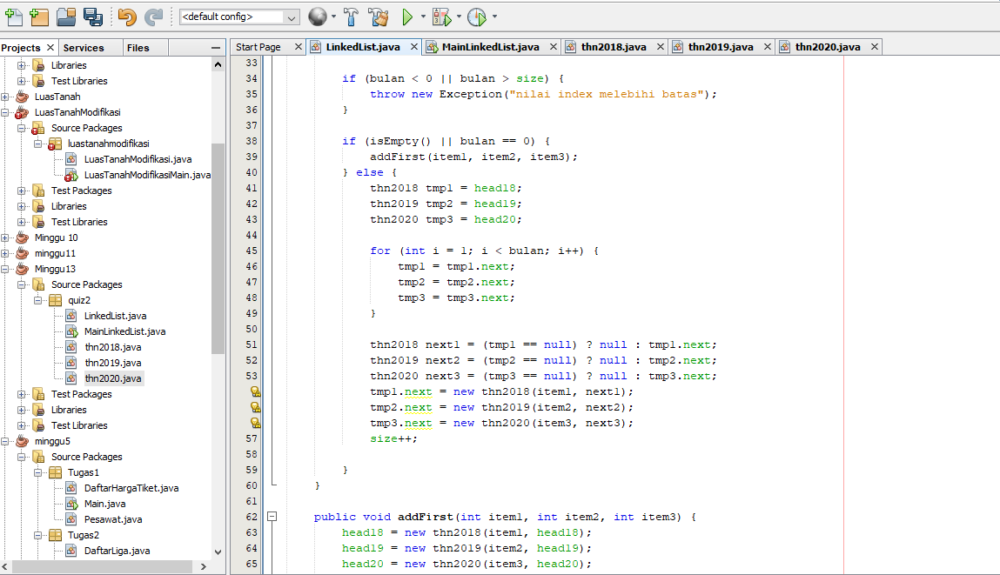
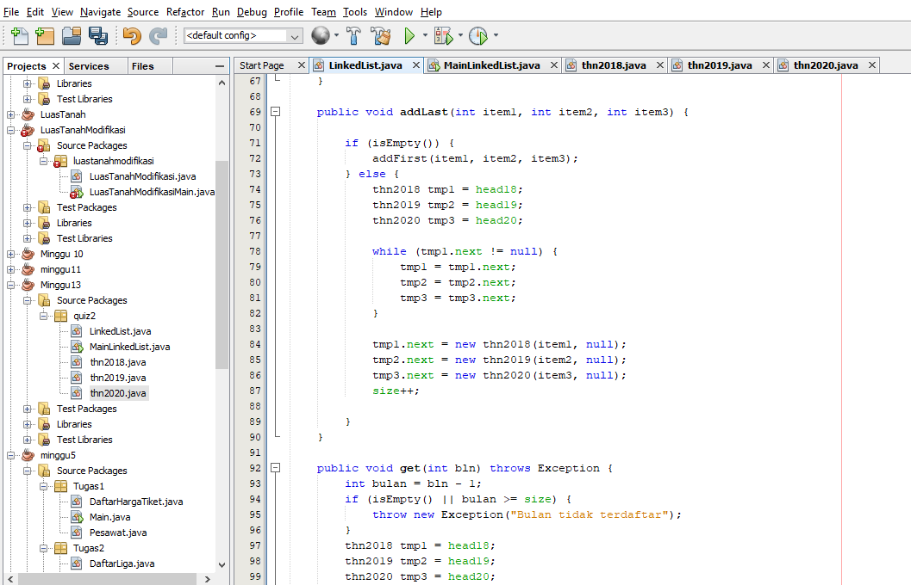
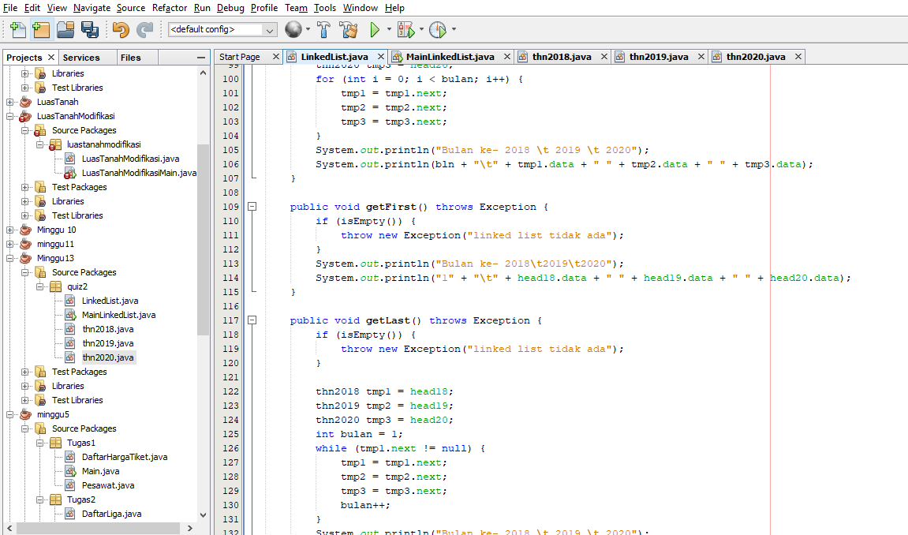
 

3. Class thn2018
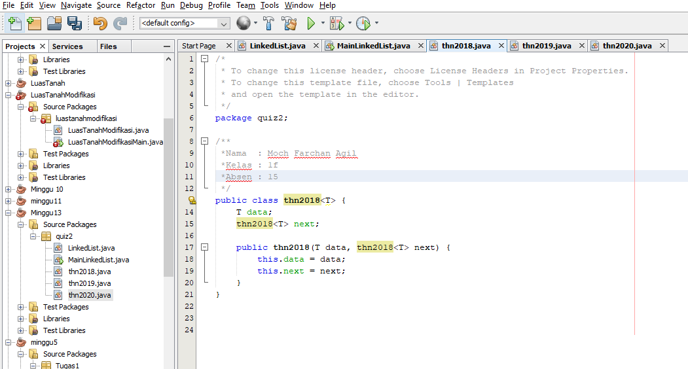

4. Class thn2019
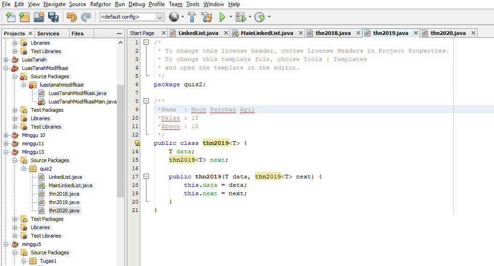

5. Class thn2020
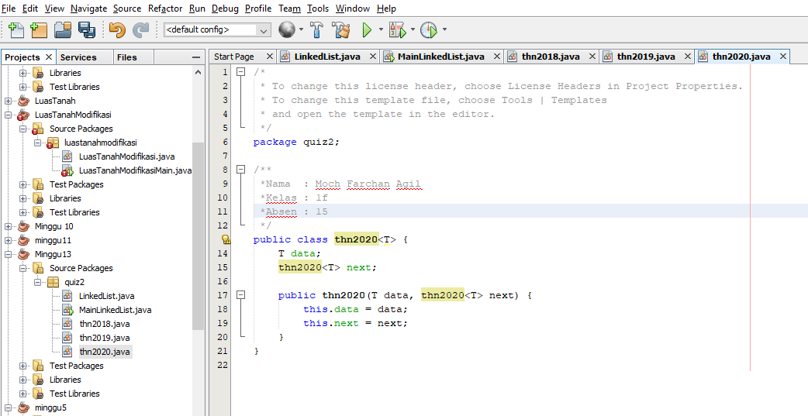

#flowchart

1. main
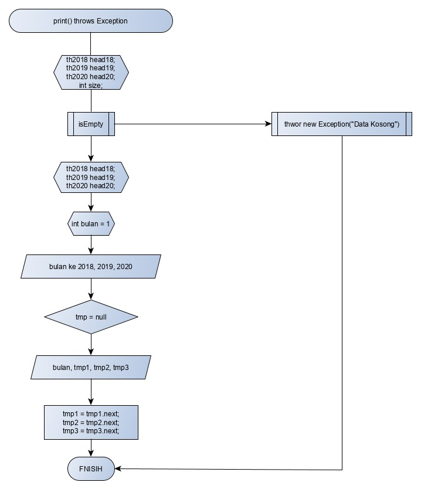

2. linkedlist()

3. addfirst()

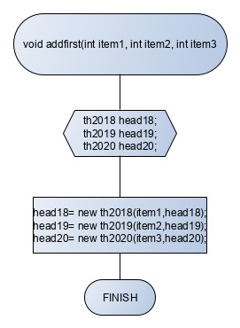

4. addlast()

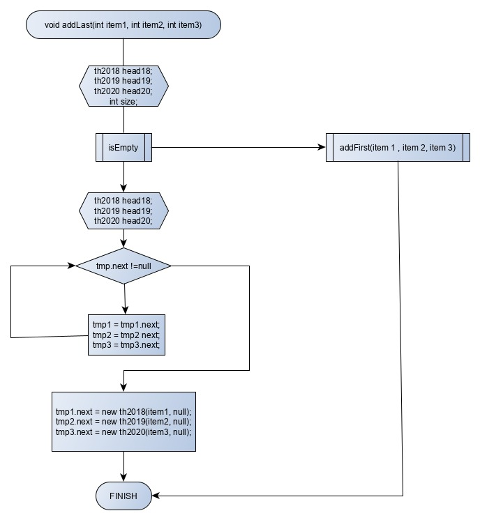

5. isempty()

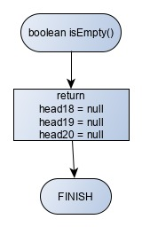

#penjelasan
saya menggunakan 5 class, yaitu class main, linkedList, dan 3 class untuk menyimpan node per tahun (2018,2019,2020). Pada class main diinputkan data secara statis sesuai data yang diberikan di soal,

1. Menggunakan method addFirst untuk mengisi data pertama,sehingga data yang baru langsung dimasukkan ke head(data pertama pada linkedlist).

2. Untuk memasukkan data selanjutnya, digunakan method addLast, yaitu memasukkan data ke node next, dilakukan pengecekan, apabila linkedlist sedang kosong, maka dipanggil method addFirst, jika tidak, maka semua data dilakukan proses traverse lalu data yang baru diinputkan diakhir perulangan traverse.

3. Print data dengan menggunakan teknik traverse, yaitu data akan disimpan sementara pada variabel tertentu lalu ditampilkan, dan variabel tersebut akan diganti dengan node next nya lalu isi variabel tersebut adalah data baru yang akan ditampilkan lagi, terus berulang seperti itu hingga variabel bernilai null atau tidak ada data lagi yang bisa ditampilkan.